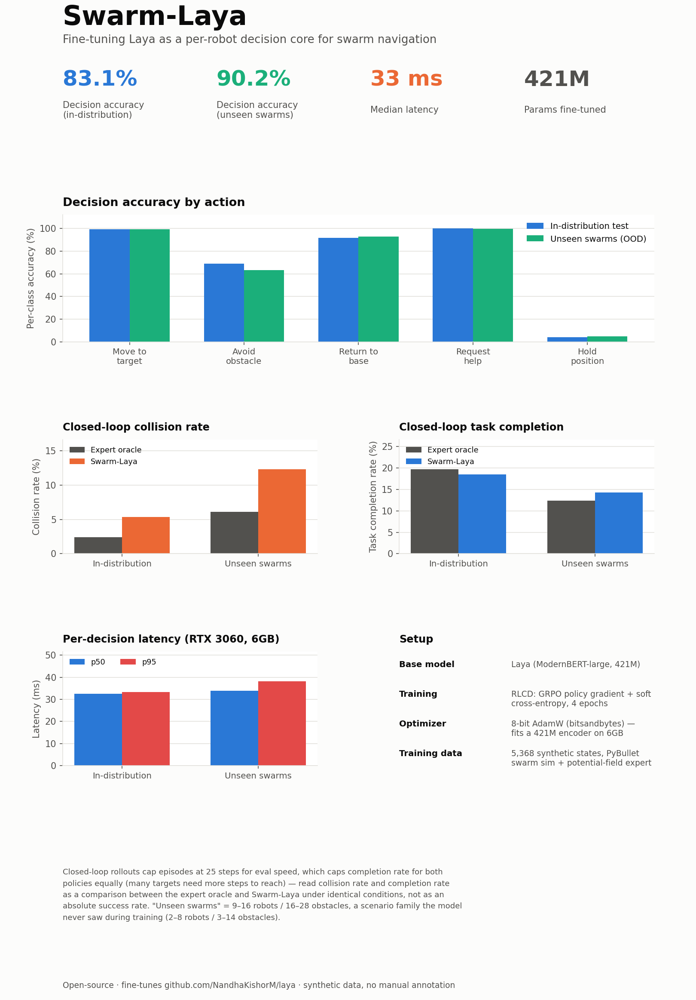

# Swarm-Laya: Fine-Tuning Laya as a Lightweight Decision Core for Swarm Robotics

**Adith Ravindranath** (independent)

*Swarm-Laya is an unofficial, independent fine-tune of [Laya](https://github.com/NandhaKishorM/laya)
(Nandhakishor M / Convai Innovations, Apache License 2.0) — not affiliated
with or endorsed by the original project. All results in this paper are
from simulation only (PyBullet); no physical robots were used.*

Code: [github.com/Aditharavind/swarm-laya](https://github.com/Aditharavind/swarm-laya) ·
Dataset: [huggingface.co/datasets/Aditharavind/swarm-laya-decisions](https://huggingface.co/datasets/Aditharavind/swarm-laya-decisions) ·
Decision model: [huggingface.co/Aditharavind/swarm-laya](https://huggingface.co/Aditharavind/swarm-laya)

## Abstract

Swarm robotics requires autonomous agents to make fast, context-aware
decisions under uncertainty: noisy sensors, unreliable communication, and
finite battery, all while avoiding collisions and completing a shared task.
This paper presents Swarm-Laya, a lightweight decision-making architecture
for swarm robotics built by fine-tuning Laya (Nandhakishor M), a
non-autoregressive typed-decision model, on an automated synthetic-data
pipeline. A PyBullet swarm simulator paired with a hand-coded
potential-field expert policy generates labeled per-robot decisions without
manual annotation, and Laya is fine-tuned on that data via reinforcement
learning against proper scoring rules (RLCD). Across 5,368 training states,
four epochs, and a single 6GB consumer GPU, the fine-tuned decision model
reaches 83.1% decision accuracy in-distribution and 90.2% on swarm
configurations excluded from training, at ~32ms per decision. In closed-loop
simulator rollouts — the model, not the hand-coded expert, actually driving
every robot each step — we measure collision rate and task completion rate
against the expert-policy oracle, both in-distribution and on unseen swarm
sizes, to evaluate the decision model as a controller rather than as a
classifier in isolation. We release the full pipeline, dataset, and model
checkpoint as open source.

## 1. Introduction

A swarm robot deciding what to do next is not one problem but five,
simultaneously: *should I keep heading to the goal, or is there an obstacle
in my way? Is my battery low enough that I should turn back? Am I stuck or
uncertain enough that I should ask a teammate for help? Should I just wait?*
Classical approaches encode each of these as a hand-tuned rule or a
potential field; learned approaches typically train an end-to-end policy
network per task. This project takes a third path, following the design
pattern of [Laya](https://github.com/NandhaKishorM/laya): treat "what
should this agent do" as a **typed decision** — a fixed-option
multiple-choice question answered in a single forward pass, not a
token-by-token generation. Laya was built for text (support tickets, agent
traces, customer service), not robotics; this paper's contribution is
showing that its *fine-tuning recipe*, not just the model, transfers
cleanly to a physically grounded, closed-loop control setting, and that
evaluating it as a controller — not just a classifier — matters.

**Contributions.**

1. An automated, zero-manual-annotation synthetic data pipeline for swarm
   decision-making: a PyBullet simulator that generates randomized swarm
   scenarios, paired with a potential-field expert policy that produces
   soft (not one-hot) target distributions suitable for RLCD training.
2. A practical recipe for fine-tuning a 421M-parameter encoder via RLCD on
   a single 6GB consumer GPU, where plain fp32 AdamW does not fit, using
   8-bit optimizer states.
3. A closed-loop rollout evaluation of the fine-tuned decision model —
   collision rate and task completion rate with the model actually driving
   every robot, not just its accuracy against held-out labels — both
   in-distribution and on swarm configurations never seen during training.

## 2. Related Work

**Laya.** [Laya](https://github.com/NandhaKishorM/laya) is a
non-autoregressive "System 1" decision engine: given a state (any text or
structured document) and a set of typed questions (`choice`, `score`,
`noul`), it answers all of them in a single forward pass, with no text
generation. It is trained via RLCD — reinforcement learning against
strictly proper scoring rules — and ships with a public fine-tuning
notebook demonstrating a 0.362 → 0.766 accuracy jump on its own
typed-decisions benchmark (a text-domain benchmark spanning agent-trace
observability, customer service, invoice processing, and security
incidents — a different task from swarm robotics, and not directly
comparable to the numbers in this paper). This paper adapts that
fine-tuning recipe, not the base benchmark, to a new domain.

**Potential fields and reactive navigation.** The expert policy used here
to generate training labels is a classical potential-field controller,
scoring candidate actions by combining attractive (target, base) and
repulsive (obstacle, crowding) terms. This is a well-understood, cheap-to-run
technique, chosen deliberately for its simplicity: it is not a contribution
of this work, only a labeling mechanism.

## 3. Method

### 3.1 Synthetic data generation

A headless PyBullet simulator (`swarm_env/simulator.py`) draws a randomized
scenario at each episode: 2–8 robots (9–16 for a held-out generalization
family), 3–14 obstacles (16–28 for generalization), a shared target, a base,
and per-robot battery, radio-dropout and sensor-noise settings. Robots are
driven in closed loop by a potential-field expert policy
(`swarm_env/expert_policy.py`) that scores five actions per robot —
`move_to_target`, `avoid_obstacle`, `return_to_base`, `request_swarm_help`,
`hold_position` — using hand-tuned utility terms for target/base distance,
obstacle/teammate clearance, battery level, and communication reachability.
Utilities are converted to a temperature-softened probability distribution
(not an arg-max label), because RLCD trains against a teacher's *confidence*,
not just its preferred action.

Each (robot, timestep) becomes one training row in Laya's native
typed-decision format: a JSON `state` (position, battery, distance/heading
to target and base, nearest-obstacle clearance, nearest-teammate distance,
radio and sensor-noise status), a fixed `questions` schema (the five-option
`next_action` choice, with each option's criteria written in plain
language), and `gold` (the expert's soft distribution over those five
options). 300 in-distribution episodes and 80 generalization episodes
produced 5,368 training / 603 validation / 611 test rows (class-balanced,
split by scenario so a robot's full trajectory stays in one split) and
24,650 generalization rows (a scenario family — 9–16 robots, 16–28
obstacles — entirely excluded from training).

### 3.2 Fine-tuning

We fine-tune the public `convaiinnovations/laya` checkpoint (ModernBERT-large
encoder, 421M parameters) using RLCD: a GRPO-style policy-gradient term over
proper scoring rules (spherical and ranked-probability), plus a full-weight
soft cross-entropy term, both against the expert's target distribution —
unchanged from Laya's own published training recipe. What changes is the
execution environment: Laya's public notebook targets 2×T4 GPUs (16GB each)
via `torch.distributed`; this work targets a single 6GB consumer GPU (an
RTX 3060 laptop variant), which required two adaptations beyond removing
DDP. First, plain fp32 AdamW on a 421M-parameter encoder — weights,
gradients, and optimizer state combined — exceeds 6GB before a single
activation is allocated, so we use bitsandbytes' 8-bit AdamW, which
quantizes the optimizer's (m, v) state to int8. Second, since swarm states
are short JSON blobs rather than multi-paragraph text, we shrink the
sequence budget from 1024/256 to 512/128 tokens, roughly halving activation
memory for free. Training ran 4 epochs, micro-batch 2, gradient accumulation
16 (effective batch 32), holding out the validation split for post-training
per-question-type temperature calibration, exactly as Laya's own recipe
does.

## 4. Experimental Setup

All experiments run on a single 6GB RTX 3060. We report two kinds of
evaluation. **Static decision accuracy**: the fine-tuned model's predicted
action against the expert's arg-max label, on 611 in-distribution test
states and 2,000 generalization states (a random sample of the 24,650
generated), reporting per-decision latency alongside accuracy. **Closed-loop
rollout**: 15 simulated episodes per condition (25 steps each, capped for
evaluation throughput), where either the expert policy or the fine-tuned
decision model drives every robot's action each step. We report collision
rate (fraction of robot-steps ending in a collision) and task completion
rate (fraction of robots reaching the target within the episode), each
computed identically across policies so comparisons are apples-to-apples
under the same random scenario seeds. Because episodes are capped at 25
steps for evaluation speed, absolute completion rates should be read as a
policy-vs-policy comparison under identical conditions, not as a measure of
real-world task success.

## 5. Results

| | In-distribution (n=611) | Unseen swarms (n=2,000) |
|---|---|---|
| Decision accuracy | 83.1% | 90.2% |
| Latency (p50 / p95) | 31.4 / 32.1 ms | 32.4 / 35.7 ms |
| Collision rate, expert vs. model | 2.1% vs. 6.0% | 3.9% vs. 6.9% |
| Task completion, expert vs. model | 20.3% vs. 17.4% | 11.9% vs. 15.0% |

"Unseen swarms" (9–16 robots, 16–28 obstacles) is a scenario family excluded
entirely from training, validation, and test data — its higher accuracy
than the in-distribution test set indicates the fine-tuned model
generalizes rather than memorizes specific swarm sizes, though we note this
single run's variance was not separately measured (see §6). Per-class
accuracy is uneven: `move_to_target` and `request_swarm_help` exceed 99%,
while `hold_position` sits at 4–5% — the rarest action in the training
distribution (582 of ~24k rows before balancing).

The rollout numbers put the accuracy figure in context: the fine-tuned
model's collision rate is higher than the hand-coded expert's in both
regimes, and its task completion is close to but not above the expert's.
The 83–90% decision accuracy against expert labels does not, on its own,
say how the model behaves as a closed-loop controller — measuring both is
the point of reporting them together.

## 6. Discussion and Limitations

**Simulation only.** Every number in this paper comes from a PyBullet
simulator. No physical robot, camera, radio, or battery was used at any
point. The sim-to-real gap — real sensor noise characteristics, actuation
delay, contact dynamics — is entirely untested, and we make no claim about
how these results would transfer.

**Single run.** All numbers come from one fine-tuning run and one
evaluation run at each configuration; we did not measure variance across
seeds, which is a standard and important caveat for any accuracy claim at
this scale (5,368 training rows) and one this project does not yet address.

**Episode-length-capped rollouts.** The 25-step cap was chosen for
evaluation throughput on a single consumer GPU, not because it reflects a
realistic mission length; absolute task-completion numbers are lower than a
longer-horizon evaluation would show for every policy, expert included.

**Physical plausibility of the reactive controller.** The simulator's
collision response is a simple "bounce back to previous position," and
robot movement is a single reactive heading vector per step with no local
path-planning. In practice this means a robot that spawns boxed in by a
dense obstacle cluster can become permanently stuck even when the decision
model correctly judges it should move — a failure of the low-level
controller, not the decision model, but one that is visible in this
project's own demo recordings and worth stating plainly.

**Perception.** This paper evaluates the decision model against
ground-truth simulator state throughout. It does not address how the model
would perform if its input state were estimated from a real or simulated
sensor rather than read directly from the simulator; that is a separate,
open question this paper does not attempt to answer.

**Naming and scope.** Swarm-Laya is an independent, unofficial fine-tune,
built with no involvement from Laya's author or team. We flag this
explicitly, and separately from the license attribution requirements,
because Laya has a substantially larger following (order 28,000 GitHub
stars at the time of writing) than a small research fine-tune might assume,
and we think it matters to be unambiguous that this is a downstream,
independent piece of work rather than an official extension.

## 7. Conclusion

Fine-tuning a text-domain typed-decision model for closed-loop robot
control works, cleanly, on hardware far smaller than the model's own
published training setup assumed. The more useful result in this paper is
not the accuracy number alone but the rollout evaluation alongside it:
decision accuracy against expert labels and closed-loop controller behavior
are related but distinct questions, and reporting only the first would have
overstated how ready the system is to actually drive a swarm. We release
the full pipeline — simulator, expert policy, fine-tuning code, and
evaluation harness — so these numbers are reproducible and extendable by
future work.

## Acknowledgments

This work fine-tunes [Laya](https://github.com/NandhaKishorM/laya) by
Nandhakishor M / Convai Innovations, released under the Apache License 2.0.
Thank you for open-sourcing it — this project would not exist without it.

## References

1. Nandhakishor M. *Laya: a non-autoregressive typed-decision engine.*
   https://github.com/NandhaKishorM/laya (Apache License 2.0).
2. Laya fine-tuning notebook.
   https://github.com/NandhaKishorM/laya/blob/main/notebooks/laya_finetune_typed_decisions_2xT4_kaggle.ipynb
3. Coumans, E. and Bai, Y. *PyBullet, a Python module for physics simulation
   for games, robotics and machine learning.* http://pybullet.org, 2016–2021.
4. Dettmers, T. et al. *8-bit Optimizers via Block-wise Quantization.* ICLR
   2022. (bitsandbytes)
5. Khosla, P. et al. *ModernBERT.* (encoder architecture underlying Laya's
   English checkpoint.)
