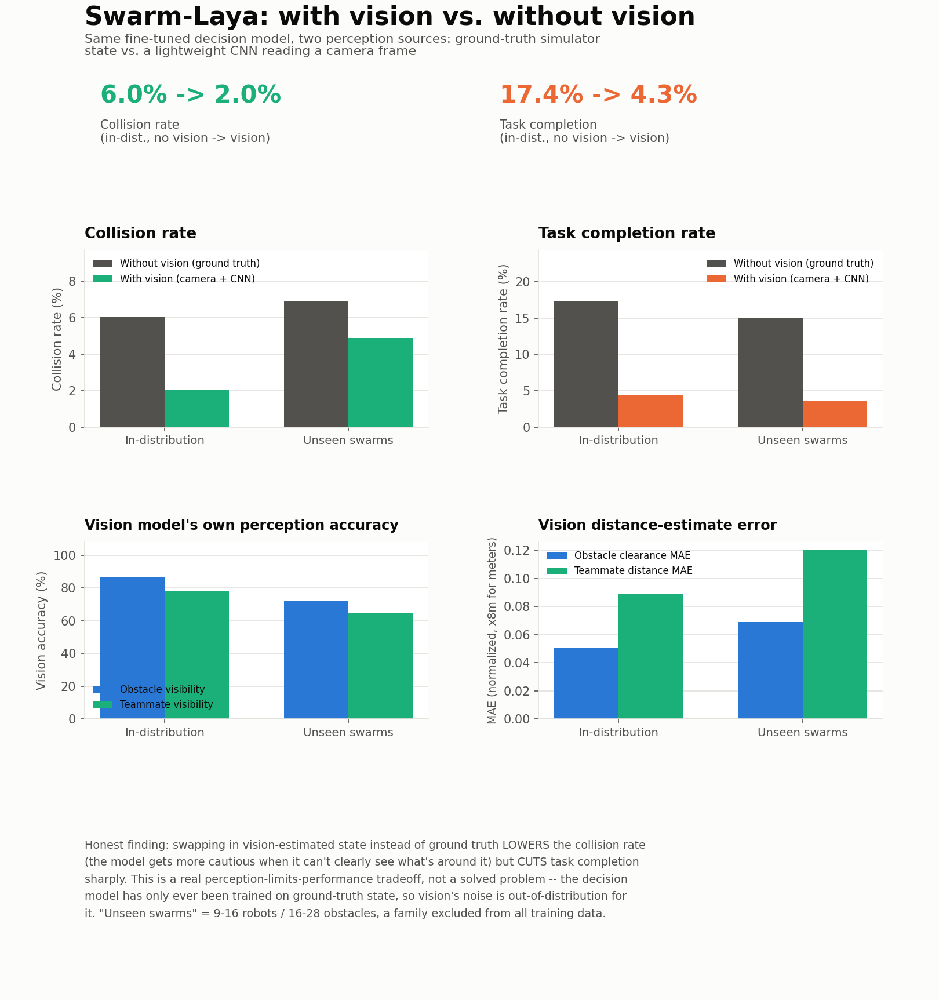

# Swarm-Laya

*An unofficial, independent fine-tune of [Laya](https://github.com/NandhaKishorM/laya)
by Nandhakishor M — not affiliated with or endorsed by the original project.*

> **Simulation only.** Every number in this repo — decision accuracy,
> collision rate, task completion, the vision model's perception accuracy —
> comes from the PyBullet simulator described below, not from physical
> robots. Sim-to-real gap (real sensor noise, actuation, latency, contact
> dynamics) is untested.

Fine-tunes [Laya](https://github.com/NandhaKishorM/laya) (by Nandhakishor M /
Convai Innovations) — a non-autoregressive "System 1" decision model that
answers typed questions (`choice` / `score` / `noul`) over a state in a
single forward pass — to make per-robot decisions in a synthetic
swarm-robotics setting, per the project abstract: separate a lightweight
vision/perception layer from a specialized decision model, trained on
labeled data from an automated synthetic-data pipeline instead of costly
real-world collection. This repo covers both halves: the decision model
(`swarm_env/`, `training/`) and a lightweight vision front end (`vision/`)
that estimates the visually-observable parts of the state from a
robot-mounted camera. All Swarm-Laya-specific code here (simulator, expert
policy, vision model) is original; the fine-tuning recipe (`training/train.py`)
is adapted from Laya's own [fine-tuning notebook](https://github.com/NandhaKishorM/laya/blob/main/notebooks/laya_finetune_typed_decisions_2xT4_kaggle.ipynb) — see the header comment in that file for exactly what changed.

**Pretrained on Hugging Face:**
[dataset](https://huggingface.co/datasets/Aditharavind/swarm-laya-decisions) ·
[decision model](https://huggingface.co/Aditharavind/swarm-laya) ·
[vision model](https://huggingface.co/Aditharavind/swarm-laya-vision)

**[Read the full paper](PAPER.md)** — method, related work, and a fuller
discussion of the results (and their limitations) than this README covers.

## Pipeline

```
swarm_env/            PyBullet swarm simulator, expert policy, state encoder, action schema
data_generation/      runs the simulator + expert policy, writes labeled Laya-format JSONL
training/             preprocess.py (tokenize) + train.py (single-GPU RLCD fine-tuning)
eval/                 decision accuracy, latency, collision rate, task completion, generalization
vision/               lightweight CNN: camera frame -> obstacle/teammate perception -> Laya state
hf/                   push the dataset/models to the Hugging Face Hub, with model cards
```

### 1. Generate the synthetic dataset

```bash
python data_generation/generate_dataset.py --out ./data --episodes 400 --ood-episodes 60
```

Each `reset()` draws a fresh scenario — 2-8 robots (9-16 for the held-out
`ood` family), 3-14 obstacles (16-28 for `ood`), a shared target, per-robot
battery, comm dropout and sensor noise. Robots are driven in closed loop by
`swarm_env/expert_policy.py`, a potential-field controller that scores five
actions (`move_to_target`, `avoid_obstacle`, `return_to_base`,
`request_swarm_help`, `hold_position`) and turns the scores into a soft
label distribution — this is the "expert planning/control policy" from the
abstract, and the distribution (not just the arg-max) becomes Laya's RLCD
training target. Output rows match the schema Laya's own fine-tuning
notebook expects: `{"state": ..., "questions": ..., "gold": ...}` written to
`data/{train,val,test}.jsonl` (in-distribution, split by scenario so a
robot's whole trajectory stays in one split) and
`data/ood_generalization.jsonl` (wider ranges, held out entirely from
training — used only in evaluation to measure generalization).

### 2. Preprocess (tokenize)

```bash
python training/preprocess.py --data-dir ./data --out-dir ./data/preprocessed
```

Downloads the base `convaiinnovations/laya` checkpoint's tokenizer/config
and tokenizes every split into `*_items.pt`, mirroring cell 6 of Laya's
[fine-tuning notebook](https://github.com/NandhaKishorM/laya/blob/main/notebooks/laya_finetune_typed_decisions_2xT4_kaggle.ipynb).

### 3. Fine-tune

```bash
python training/train.py --data-dir ./data/preprocessed --output-dir ./checkpoints/swarm_laya
```

This is the notebook's `train_ddp.py` (RLCD: GRPO-style policy gradient over
proper scoring rules + soft cross-entropy, gradient checkpointing, fp16)
with `torch.distributed`/DDP removed for a single GPU. Defaults
(`--micro-batch 2 --grad-accum 16`, effective batch 32) are sized for a 6 GB
card — **this machine has a 6 GB RTX 3060, not the 12 GB the abstract
assumed**; raise `--micro-batch` if you run it on a bigger GPU. Plain fp32
AdamW on ModernBERT-large's 421M parameters alone (weights + gradients +
optimizer state) exceeds 6 GB before a single activation is allocated, so
the optimizer is [bitsandbytes](https://github.com/bitsandbytes-foundation/bitsandbytes)'
8-bit AdamW instead, falling back to plain `torch.optim.AdamW` if
bitsandbytes isn't installed. `--max-len 512 --head-max-len 128` also
shrink the notebook's 1024/256 budget, since swarm states are short JSON
blobs, not multi-paragraph tickets — this roughly halves activation memory
for free. Calibration temperatures (one per question type) are fit on the
`val` split after the last epoch, exactly as the notebook does on its
held-out calibration slice.

### 4. Evaluate

```bash
python eval/evaluate.py --checkpoint ./checkpoints/swarm_laya
```

Reports the abstract's metrics:
- **decision accuracy** and **per-class accuracy** against expert labels, on
  `test.jsonl` (in-distribution) and `ood_generalization.jsonl` (unseen
  scenarios)
- **response latency** (p50/p95, ms) per decision
- **collision rate** and **task completion rate** from closed-loop
  simulator rollouts where the fine-tuned model (instead of the expert)
  picks every robot's action each step, compared against the expert-policy
  oracle as an upper bound, for both scenario families

Full results land in `eval_report.json`. Render a shareable summary image with
`python eval/make_results_card.py`, or record a top-down rollout video with
`python eval/record_demo.py --checkpoint ./checkpoints/swarm_laya`.

## Results

One fine-tuning run: 5,368 training states (300 episodes, 2-8 robots,
3-14 obstacles), 4 epochs, single 6 GB RTX 3060.


| | in-distribution | unseen swarms (9-16 robots, 16-28 obstacles) |
|---|---|---|
| decision accuracy | 83.1% (n=611) | 90.2% (n=2,000) |
| latency (p50 / p95) | 31.4 / 32.1 ms | 32.4 / 35.7 ms |
| collision rate, expert vs. model | 2.1% vs. 6.0% | 3.9% vs. 6.9% |
| task completion, expert vs. model | 20.3% vs. 17.4% | 11.9% vs. 15.0% |

`demo.mp4` is a top-down recording of the fine-tuned model driving every
robot in three rollouts (two in-distribution, one unseen-swarm) — the panel
next to the arena shows the literal state JSON going into the model for one
robot (rotating through the swarm) and every robot's predicted action +
confidence, live.

Reading the rollout numbers: episodes are capped at 25 steps for eval speed,
which caps completion rate for both policies alike (many targets need more
steps than that to reach on foot) — the meaningful comparison is
model-vs-expert under identical conditions, not the absolute rate. The
weakest per-class accuracy is on `hold_position` (~4-5%) — it's the rarest
action in the training distribution (582 of ~24k pre-balancing rows), so the
model under-predicts it; more `hold_position` examples (or explicit
upweighting) is the obvious next lever, along with an unbalanced test-set
sanity check per `docs/finetune.md`'s advice to check per-workflow accuracy,
not just the aggregate.

## Vision front end

`vision/` adds the perception half the abstract calls for: a **~137K-parameter
CNN**, trained from scratch on PyBullet-rendered 64x64 first-person camera
frames, that estimates the visually-observable parts of a robot's state —
whether an obstacle/teammate is visible, its distance, and its bearing
relative to the robot's own heading. Battery, radio-link status and target
direction stay as telemetry (a camera can't see a robot's own battery
percentage), matching how real robots fuse camera + IMU/GPS/radio.

```bash
python vision/generate_vision_dataset.py --out ./data/vision --episodes 150 --ood-episodes 30
python vision/train_vision.py --data-dir ./data/vision --out ./checkpoints/swarm_vision.pt
python eval/evaluate.py --checkpoint ./checkpoints/swarm_laya \
    --vision-checkpoint ./checkpoints/swarm_vision.pt   # adds a model_vision rollout policy
python eval/record_demo.py --checkpoint ./checkpoints/swarm_laya \
    --vision-checkpoint ./checkpoints/swarm_vision.pt --out ./demo_vision.mp4
```

`demo_vision.mp4` is the same side-by-side format as `demo.mp4`, but every
robot's action now comes from vision-perceived state, and the model-input
panel shows the focused robot's actual camera frame plus the vision model's
own (imperfect — matching the accuracy numbers below, not artificially
perfect) obstacle/teammate estimate for that frame, instead of raw JSON.

**Vision model, standalone** (12,112 training frames, 15 epochs):

| | in-distribution | unseen swarms |
|---|---|---|
| obstacle-visibility accuracy | 86.7% | 72.2% |
| teammate-visibility accuracy | 78.1% | 64.9% |
| obstacle clearance MAE | 0.40 m | 0.55 m |
| teammate distance MAE | 0.71 m | 0.96 m |

**What happens when Laya decides from vision instead of ground truth**
(closed-loop rollout, same 25-step cap):



| | collision rate: ground truth vs. vision | task completion: ground truth vs. vision |
|---|---|---|
| in-distribution | 6.0% vs. 2.0% | 17.4% vs. 4.3% |
| unseen swarms | 6.9% vs. 4.9% | 15.0% vs. 3.6% |

`demo_vision.mp4` shows this live: the panel next to the arena is the
robot's actual camera frame plus the vision model's real (sometimes wrong)
obstacle/teammate estimate for that exact frame, side by side with the
decision it produces. Regenerate the chart above with
`python eval/make_vision_comparison_card.py`.

**Honest finding, not a hidden one:** vision-based perception *lowers* the
collision rate — the decision model gets more cautious when it can't clearly
see what's around it — but *cuts task completion sharply*. That's a genuine
perception-limits-performance tradeoff, exactly what re-evaluating end to end
was supposed to surface. The obvious next levers: a wider camera FOV, a
second camera facing backward, or training the decision model itself on
vision-composed states (right now it's only ever seen ground truth at
training time, so vision's noise is out-of-distribution for it twice over).

## Design notes

- **Decisions are a single `choice` question** (`next_action`, five
  options), matching Laya's typed-decision primitives directly rather than
  a continuous control output — Laya is a classifier over a fixed option
  set, not a policy network, so "navigation, collision avoidance, task
  prioritization, swarm coordination and failure recovery" from the
  abstract are folded into that one categorical decision per robot per
  step; a discrete choice is then converted to a heading for the simulator.
- **State is a flat JSON object** (position, battery, distance/heading to
  target and base, nearest obstacle clearance, nearest teammate, comm and
  sensor-noise status) — this is exactly the "state" Laya reads as text, so
  it doubles as a human-readable log line.
- **Gold labels are soft distributions**, not one-hot: the expert policy's
  per-action utilities are turned into a temperature-softened distribution,
  because RLCD trains against a teacher's confidence, not just its arg-max
  — per `docs/finetune.md` in the Laya repo, "the loop is only as good as
  the targets."
- **`ood_generalization.jsonl`** is drawn from a scenario family (9-16
  robots, 16-28 obstacles) disjoint from anything in `train`/`val`/`test`
  (2-8 robots, 3-14 obstacles), so its accuracy and rollout numbers are a
  genuine generalization measurement, not a held-out slice of the same
  distribution.

## Roadmap

- [x] Synthetic data generation (PyBullet + potential-field expert)
- [x] RLCD fine-tuning on a single 6GB consumer GPU
- [x] Static + closed-loop rollout evaluation, in-distribution and OOD
- [x] **Vision front end** — a lightweight CNN reading a robot-mounted
      first-person camera, estimating the visually-observable parts of the
      state (nearest obstacle/teammate distance + bearing) while battery,
      radio link and target direction stay as non-visual telemetry
- [x] Re-evaluated end to end with vision-estimated (noisy) state in place of
      ground truth — see [Vision front end](#vision-front-end) above
- [ ] Train the decision model itself on vision-composed (not just
      ground-truth) states, so it isn't seeing out-of-distribution noise
      for the first time at inference
- [ ] A local escape/replanning behavior for robots boxed in by a dense
      obstacle cluster — the current single-step reactive heading can get a
      robot permanently stuck if every direction collides
- [ ] Real-robot validation (sim-to-real is completely untested right now)
